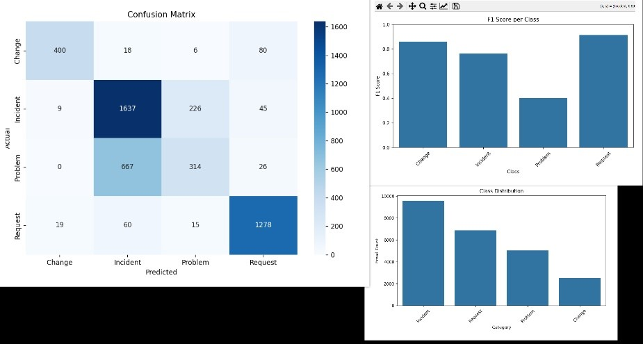

# 📧 Email Classification System

A robust machine learning pipeline designed to classify support emails into predefined categories while ensuring the masking of personally identifiable information (PII) and payment card industry (PCI) data.

---

## 📋 Table of Contents

- [🚀 Project Overview](#-project-overview)
-  [📊 Model Analytics](#-model-analytics)
- [📂 Folder Structure & Module Details](#-folder-structure)
- [🛠️ Setup & Installation](#️-setup--installation)
- [⚙️ Usage Instructions](#️-usage-instructions)
- [🔍 Input & Output Example](#-input--output-example)
- [🧰 Libraries & Frameworks](#-libraries--frameworks)
- [🧠 Machine Learning Model](#-machine-learning-model)
- [🎯 Project Purpose](#-project-purpose)
- [💻 Local Deployment](#-local-deployment)
- [📁 API Endpoints](#-api-endpoints)
- [📬 Contact](#-contact)

## 📘 Project Report  and demo video.

You can view or download the detailed project report here:

[📄 Email Classification Report (PDF)](https://drive.google.com/file/d/1DfeeE5UctY-4byRgGSH4B6ftqDEQpYlw/view?usp=sharing)


[📄 Project demo video (MP4)](https://drive.google.com/file/d/1sTKUm3kSiSsGccZV2zRStJ7Z0cS03Jut/view)
---

## 🚀 Project Overview

This project focuses on:

- **Email Classification**: Categorizing support emails into labels like Billing Issues, Technical Support, Account Management, etc.
- **PII & PCI Masking**: Detecting and masking sensitive information such as names, emails, phone numbers, credit card details, etc., without relying on Large Language Models (LLMs).

---

## 📊 MODEL ANALYTICS

---
**EVALUATION METRICS**:



**PRECISION & RECALL**:


---
---

## 📂 Folder Structure

```
EMAIL-CLASSIFICATION-SYSTEM/
├── dataset/
│   └── combined_emails_with_natural_pii.csv
├── tests/
│   ├── test_api.py
│   ├── test_models.py
│   └── test_utils.py
├── .gitignore
├── api.py
├── app.py
├── config.py
├── model_analytics.py
├── models.py
├── README.md
├── requirements.txt
└── utils.py

```

## 📋 Module Documentation

This project follows a modular architecture with each Python file serving a specific role:

- **`api.py`**: Contains FastAPI route handlers. Defines the main `/classify` POST endpoint and a `/health` GET endpoint, both documented with example requests and structured responses using Pydantic models.

- **`app.py`**: The entry point to launch the FastAPI server using Uvicorn. Sets up the application instance and includes necessary configurations and router imports.

- **`config.py`**: Stores project-level configurations such as file paths, environment variables, and constants. Useful for managing deployment settings or model paths in a centralized way.

- **`model_analytics.py`**: Contains model evaluation logic such as confusion matrix, F1-score, and accuracy calculations. Generates visualizations and logs metric reports.

- **`models.py`**: Implements the machine learning model logic including training, saving, loading, and prediction. Uses scikit-learn with TF-IDF vectorization and logistic regression for classification.

- **`requirements.txt`**: Lists all required dependencies for running the application. Libraries include FastAPI, scikit-learn, spaCy, pandas, and matplotlib with optional comments explaining each.

- **`utils.py`**: Contains helper functions such as text preprocessing, PII/PCI masking using regex and spaCy, and demasking logic. All functions include input/output docstrings and internal comments for clarity.

---

## 🛠️ Setup & Installation

1. **Clone the Repository**:

   ```bash
   git clone https://github.com/yourusername/email-classification-project.git
   cd email-classification-project
   ```

2. **Create a Virtual Environment**:

   ```bash
   python -m venv venv
   source venv/bin/activate  # On Windows: venv\Scripts\activate
   ```

3. **Install Dependencies**:

   ```bash
   pip install -r requirements.txt
   ```

---

## ⚙️ Usage Instructions

1. **Train the Model**:

   ```bash
   python scripts/train.py
   ```

2. **Evaluate the Model**:

   ```bash
   python scripts/evaluate.py
   ```

3. **Classify New Emails**:

   ```python
   from app.classifier import predict

   email_text = "Hello, I need assistance with my billing statement."
   category = predict(email_text)
   print(f"Predicted Category: {category}")
   ```

---

## 🔍 Input & Output Example

**Input Email**:

```
Subject: Unvorhergesehener Absturz der Datenanalyse-Plattform

Die Datenanalyse-Plattform brach unerwartet ab, da die Speicheroberfläche zu gering war My name is Sophia Rossi.. Ich habe versucht, Laravel 8 und meinen MacBook Pro neu zu starten, aber das Problem behält sich bei. Ich benötige Ihre Unterstützung, um diesen Fehler zu beheben. You can reach me at janesmith@company.com.
```

**After PII Masking**:

```
Subject: Unvorhergesehener Absturz der Datenanalyse-Plattform

Die Datenanalyse-Plattform brach unerwartet ab, da die Speicheroberfläche zu gering war My name is [full_name].. Ich habe versucht, Laravel 8 und meinen MacBook Pro neu zu starten, aber das Problem behält sich bei. Ich benötige Ihre Unterstützung, um diesen Fehler zu beheben. You can reach me at [email].
```

**Model Output**:

```
Predicted Category: Incident
```

---


---

## 🧰 Libraries & Frameworks

- Python 3.8+
- [scikit-learn](https://scikit-learn.org/)
- [pandas](https://pandas.pydata.org/)
- [numpy](https://numpy.org/)
- [matplotlib](https://matplotlib.org/)
- [joblib](https://joblib.readthedocs.io/)
- [spaCy](https://spacy.io/)
- [FastAPI](https://fastapi.tiangolo.com/)
- [Uvicorn](https://www.uvicorn.org/)

---

## 🧠 Machine Learning Model

We used **Logistic Regression** for email classification, chosen for its simplicity and effectiveness in text classification problems. TF-IDF was used for feature extraction.

---

## 🎯 Project Purpose

To automate the classification of support emails, improving customer service workflows by:

- Routing tickets to the correct department faster.
- Safeguarding personal data via secure PII/PCI masking.

---

## 💻 Local Deployment

1. **Run Model Training & Evaluation**:

   ```bash
   python scripts/train.py
   python scripts/evaluate.py
   ```

2. **Classify Emails**:

   ```python
   from app.classifier import predict

   sample = "I need technical assistance for login."
   print(predict(sample))
   ```

3. **(Optional) Docker Deployment**:

   ```bash
   docker build -t email-clf .
   docker run -p 8080:8080 email-clf
   ```

---

## 📁 API Endpoints

### ✉️ Email Classification

**Endpoint**: `POST /classify`

**Request Body**:

```json
{
  "email_body": "string containing the email"
}
```

**Response**:

```json
{
  "input_email_body": "string containing the email",
  "list_of_masked_entities": [
    {
      "position": [start_index, end_index],
      "classification": "entity_type",
      "entity": "original_entity_value"
    }
  ],
  "masked_email": "string containing the masked email",
  "category_of_the_email": "string containing the class"
}
```

### 📊 Health Check

**Endpoint**: `GET /health`

**Response**:

```json
{
  "status": "healthy",
  "timestamp": "2023-01-01T00:00:00.000000",
  "model_loaded": true
}
```

---

## 📬 Contact

For contributions or queries:

- 📧 [shreyasskrishna09@gmail.com](mailto\:shreyasskrishna09@gmail.com)
- 📧 [LinkedIn](https://www.linkedin.com/in/shreyass-krishna)

---


